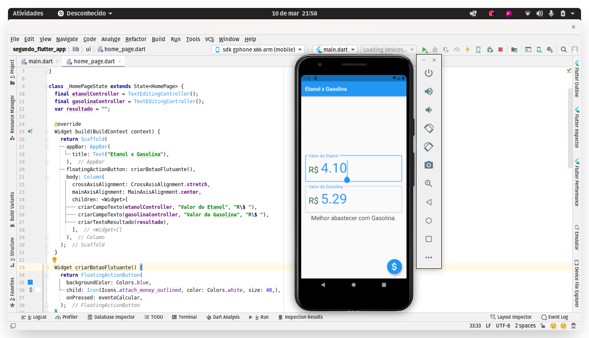

## Etanol ou Gasolina?
> Meu segundo App criado com Flutter na aula de Programação para Dispositivos Móveis. Professor Marcos Dias Vendramini.

O App calcula qual combustível é mais viável para o usuário com base no valor de ambos.

### Screenshot

